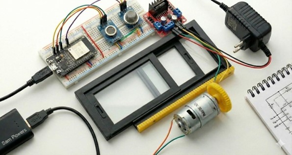
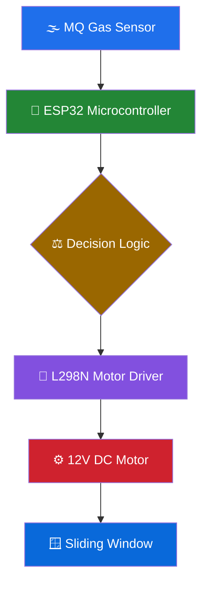
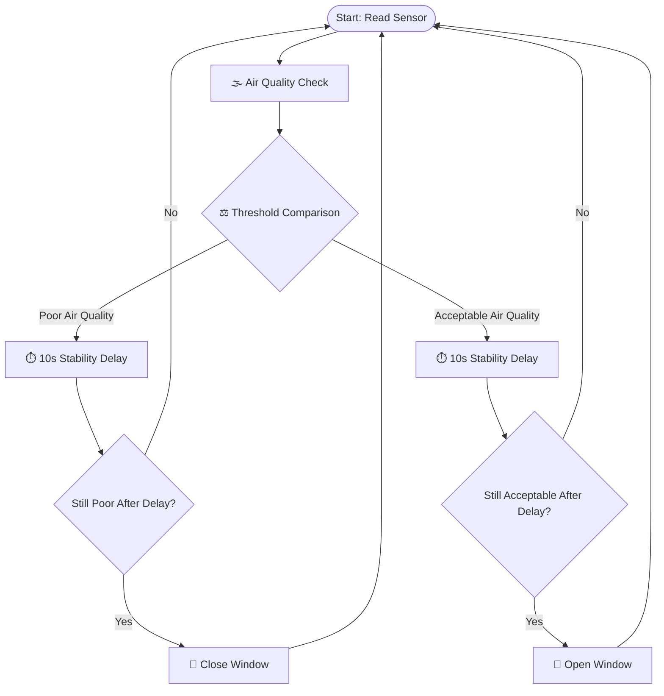
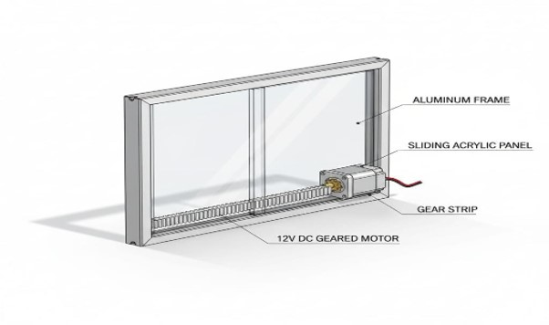
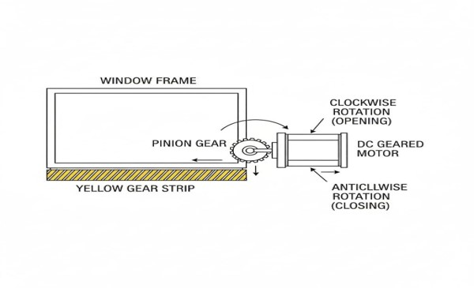
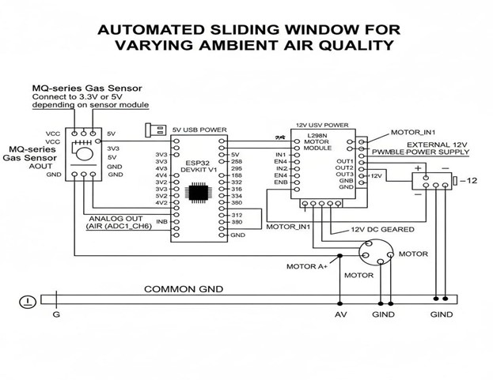
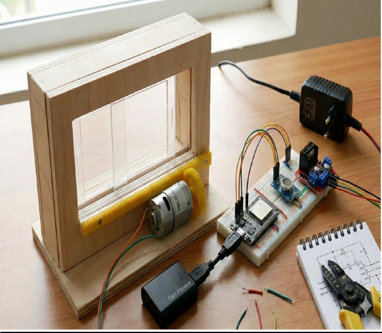

<div align="center">

# 🌬️ Air Quality Smart Window

### ESP32-Based Automated Sliding Window for Ambient Air Quality Monitoring



<br/>

[](https://www.espressif.com/en/products/socs/esp32)
[](https://www.arduino.cc/)
[](#)
[](#)
[](#)

<br/>

*An autonomous embedded system that monitors indoor air quality in real time and physically actuates a sliding window to regulate ventilation — no manual intervention required.*

</div>

---

## 📖 Table of Contents

- [Project Overview](#-project-overview)
- [Key Features](#-key-features)
- [System Architecture](#-system-architecture)
- [Hardware Components](#-hardware-components)
- [Wiring Overview](#-wiring-overview)
- [Mechanical Design](#-mechanical-design)
- [Engineering Calculations](#-engineering-calculations)
- [Control Logic](#-control-logic)
- [Repository Structure](#-repository-structure)
- [Project Gallery](#-project-gallery)
- [Installation and Setup](#-installation-and-setup)
- [Results](#-results)
- [Future Scope](#-future-scope)
- [Contributors](#-contributors)

---

## 🧭 Project Overview

Indoor air quality is one of the most overlooked factors affecting health, focus, and well-being — yet most indoor spaces have no automated way to respond to it. Pollutant levels from cooking, dust, combustion gases, or simply poor cross-ventilation can build up unnoticed, especially in spaces that stay closed for long periods.

**Air Quality Smart Window** solves this with a self-contained embedded system that:

- 📡 Continuously samples ambient air quality using a gas sensor
- 🧠 Evaluates pollutant concentration against a configurable threshold
- ⚙️ Drives a rack-and-pinion mechanism to physically slide a window open or shut
- 💡 Provides instant visual feedback via LED indicators

### Problem Statement
Manual window control is reactive, inconsistent, and easy to forget — by the time poor air quality is noticed, occupants have already been exposed to it.

### Why Indoor Air Quality Matters
Poor ventilation directly correlates with reduced cognitive performance, respiratory discomfort, and long-term health risks. Automating the response closes the gap between *detection* and *action*.

### Why Window Automation
A window is the simplest, most energy-efficient ventilation actuator already present in almost every room. Automating it — rather than introducing a new HVAC component — keeps the solution low-cost, retrofit-friendly, and mechanically simple.

### Project Goals
- Build a closed-loop, sensor-driven ventilation control system
- Demonstrate reliable mechanical actuation using a rack-and-pinion drivetrain
- Eliminate false-trigger oscillation through stability-delay logic
- Keep the entire system low-cost, modular, and reproducible

---

## ✨ Key Features

| Feature | Description |
|---|---|
| 🌫️ **Real-Time Air Quality Monitoring** | Continuous gas concentration sampling via MQ-series sensor |
| 🪟 **Automatic Window Control** | Fully autonomous open/close actuation — zero manual input |
| ⚙️ **Rack and Pinion Mechanism** | Converts rotary motor motion into smooth linear sliding motion |
| 🧠 **ESP32-Based Control System** | Central decision-making and sensor-to-actuator orchestration |
| 🔌 **L298N Motor Driver** | Bidirectional control of the 12V DC geared motor |
| 🎚️ **Adjustable Threshold** | Tunable air quality cutoff for different environments |
| ⏱️ **Stability Delay Logic** | 10-second debounce window prevents motor chatter on noisy readings |
| 🔵🔴 **Visual LED Indication** | Instant status feedback — clean air vs. poor air quality |

---

## 🏗️ System Architecture



The architecture follows a clean **sense → decide → actuate** pipeline: the MQ gas sensor feeds raw analog readings to the ESP32, which evaluates them against a configured threshold and drives the L298N module to rotate the geared motor in the required direction — translating into linear rack-and-pinion motion at the window.

---

## 🔩 Hardware Components

| Component | Specification | Purpose |
|---|---|---|
| **ESP32 Dev Board** | Dual-core, Wi-Fi/BLE enabled MCU | Central processing and control logic |
| **MQ Gas Sensor** | Analog output, heater-based metal oxide sensor | Detects ambient air quality / gas concentration |
| **L298N Motor Driver** | Dual H-Bridge, 5V–35V input | Drives and reverses the DC geared motor |
| **12V Geared DC Motor** | 30 RPM, high-torque gearbox | Provides rotary motion for the pinion |
| **LEDs (Blue & Red)** | 5mm, forward-biased indicators | Visual status: clean air vs. poor air quality |
| **Resistors** | 220Ω current-limiting | Protects LEDs from overcurrent |
| **12V DC Adapter** | 2A regulated supply | Powers motor driver and motor assembly |
| **Rack & Pinion Assembly** | 11" rack, 3 cm pinion diameter | Converts rotary motion into linear sliding motion |

---

## 🔌 Wiring Overview

<details>
<summary><b>Click to expand GPIO Mapping Table</b></summary>

| Module | Pin / Signal | ESP32 GPIO |
|---|---|---|
| MQ Gas Sensor | Analog Output (AOUT) | GPIO 34 |
| MQ Gas Sensor | VCC | 5V |
| MQ Gas Sensor | GND | GND |
| L298N Motor Driver | IN1 | GPIO 25 |
| L298N Motor Driver | IN2 | GPIO 26 |
| L298N Motor Driver | ENA | GPIO 27 |
| Blue LED (Clean Air) | Anode (+) | GPIO 18 |
| Red LED (Poor Air) | Anode (+) | GPIO 19 |

</details>

> 💡 **Note:** All grounds (ESP32, L298N, sensor, LEDs) must share a common ground reference for stable analog readings.

---

## ⚙️ Mechanical Design

The actuation system relies on a **rack-and-pinion drivetrain** — a proven mechanism for converting rotational motor output into precise linear displacement.

- The **pinion** (3 cm diameter) is mounted directly on the geared DC motor shaft.
- The **rack** (11-inch length) is fixed along the window's sliding track.
- As the motor rotates, the pinion teeth engage the rack, translating rotary motion into linear sliding motion — pushing the window open or pulling it shut.
- This mechanism was chosen over belt or pulley alternatives for its **mechanical simplicity, positional accuracy, and minimal slack**.

---

## 📐 Engineering Calculations

<details>
<summary><b>Click to expand calculation breakdown</b></summary>

**Given Parameters**

| Parameter | Value |
|---|---|
| Rack Length | 11 inches (≈ 27.94 cm) |
| Pinion Diameter | 3 cm |
| Motor Speed | 30 RPM |

**Pinion Circumference**

```
C = π × D
C = π × 3 cm
C ≈ 9.42 cm  (linear travel per full pinion rotation)
```

**Linear Speed of Rack**

```
Linear Speed = Pinion Circumference × Motor RPM / 60
Linear Speed = 9.42 cm × 30 / 60
Linear Speed ≈ 4.71 cm/s
```

**Theoretical Travel Time (Full Rack Length)**

```
Travel Time = Rack Length / Linear Speed
Travel Time = 27.94 cm / 4.71 cm/s
Travel Time ≈ 5.93 s  →  Measured & Calibrated: 6500 ms
```

The measured travel time of **6500 ms** accounts for real-world factors such as gear backlash, motor startup torque delay, and mechanical friction not captured in the ideal calculation.

</details>

---

## 🧠 Control Logic



The **10-second stability delay** is the core of the control logic's reliability — it prevents the motor from reacting to momentary sensor noise or transient pollutant spikes, ensuring the window only moves when air quality has *genuinely* changed state.

---

## 🗂️ Repository Structure

```
AirQuality-Smart-Window/
├── firmware/
│   └── main.ino
├── docs/
│   ├── Project_Report.pdf
│   └── Project_Presentation.pptx
├── images/
│   ├── System_Design_Render.jpg
│   ├── Hardware_Prototype_Setup.jpg
│   ├── Rack_and_Pinion_Mechanism.jpg
│   ├── Circuit_Diagram.jpg
│   └── Final_Prototype_Model.png
└── README.md
```

---

## 🖼️ Project Gallery

<table>
<tr>
<td align="center" width="50%">
<br/>
<b>System Design Render</b>
</td>
<td align="center" width="50%">
<br/>
<b>Hardware Prototype Setup</b>
</td>
</tr>
<tr>
<td align="center" width="50%">
<br/>
<b>Rack and Pinion Mechanism</b>
</td>
<td align="center" width="50%">
<br/>
<b>Circuit Diagram</b>
</td>
</tr>
<tr>
<td align="center" colspan="2">
<br/>
<b>Final Prototype Model</b>
</td>
</tr>
</table>

---

## 🚀 Installation and Setup

<details>
<summary><b>1️⃣ Hardware Setup</b></summary>

1. Mount the ESP32, L298N driver, and MQ gas sensor on a common base or perfboard.
2. Assemble the rack-and-pinion mechanism along the window's sliding track, ensuring the pinion engages the rack teeth smoothly.
3. Mount the geared DC motor with its shaft aligned to the pinion.
4. Position LEDs in a visible location for status indication.

</details>

<details>
<summary><b>2️⃣ Wiring Setup</b></summary>

1. Connect the MQ sensor's analog output to **GPIO 34**.
2. Wire the L298N's `IN1`, `IN2`, and `ENA` pins to **GPIO 25, 26, 27** respectively.
3. Connect Blue and Red LEDs (with 220Ω resistors) to **GPIO 18** and **GPIO 19**.
4. Ensure a **common ground** across the ESP32, L298N, sensor, and LED circuit.
5. Power the L298N and motor from the 12V adapter; power the ESP32 via USB or a regulated 5V source.

</details>

<details>
<summary><b>3️⃣ Arduino IDE Installation</b></summary>

1. Download and install the [Arduino IDE](https://www.arduino.cc/en/software).
2. Launch the IDE and open **File → Preferences**.

</details>

<details>
<summary><b>4️⃣ ESP32 Board Installation</b></summary>

1. In **Preferences**, add the following URL under *Additional Board Manager URLs*:
   ```
   https://raw.githubusercontent.com/espressif/arduino-esp32/gh-pages/package_esp32_index.json
   ```
2. Go to **Tools → Board → Boards Manager**, search `ESP32`, and install the package.
3. Select your specific ESP32 dev board under **Tools → Board**.

</details>

<details>
<summary><b>5️⃣ Upload Firmware</b></summary>

1. Open `firmware/main.ino` in the Arduino IDE.
2. Select the correct **COM Port** under **Tools → Port**.
3. Click **Upload** and wait for the "Done uploading" confirmation.

</details>

<details>
<summary><b>6️⃣ Testing Procedure</b></summary>

1. Power on the system and allow the MQ sensor a brief warm-up period for stable readings.
2. Introduce a controlled pollutant source (e.g., smoke or gas lighter near the sensor) and observe the Red LED activation.
3. Confirm the window closes after the 10-second stability delay.
4. Clear the air and verify the Blue LED activates, followed by the window reopening after the delay period.

</details>

---

## 📊 Results

✅ Window reliably **opens** when air quality readings fall within the acceptable range.

✅ Window reliably **closes** when pollutant concentration crosses the defined threshold.

✅ The **10-second stability delay** effectively eliminates unnecessary motor activity from sensor noise.

✅ The complete sense-decide-actuate loop achieved **consistent, repeatable operation** across multiple test cycles.

---

## 🔮 Future Scope

- 📈 **AQI Sensor Integration** — Replace/augment MQ sensor with calibrated AQI-grade sensors (PM2.5, PM10, CO₂)
- ☁️ **IoT Cloud Monitoring** — Stream live air quality data to a cloud dashboard (Firebase / ThingSpeak / AWS IoT)
- 📱 **Mobile Application** — Remote monitoring and manual override via a companion app
- 🤖 **Predictive Ventilation** — ML-based forecasting of air quality trends for proactive window control
- ☀️ **Solar-Powered Operation** — Fully off-grid, energy-autonomous deployment

---

## 👥 Contributors

<div align="center">

| Name | Role |
|---|---|
| **Samarth Ichageri** | Electronics & Mechanical Systems Lead |
| **Satvik Pandurangi** | Hardware & Software Engineer |


*Project developed as part of the ECE Interdisciplinary (IDT) curriculum, Jain College of Engineering and Technology, Hubballi — Academic Year 2025–26.*

</div>

---

<div align="center">

### ⭐ If you found this project interesting, consider starring the repository!

</div>
